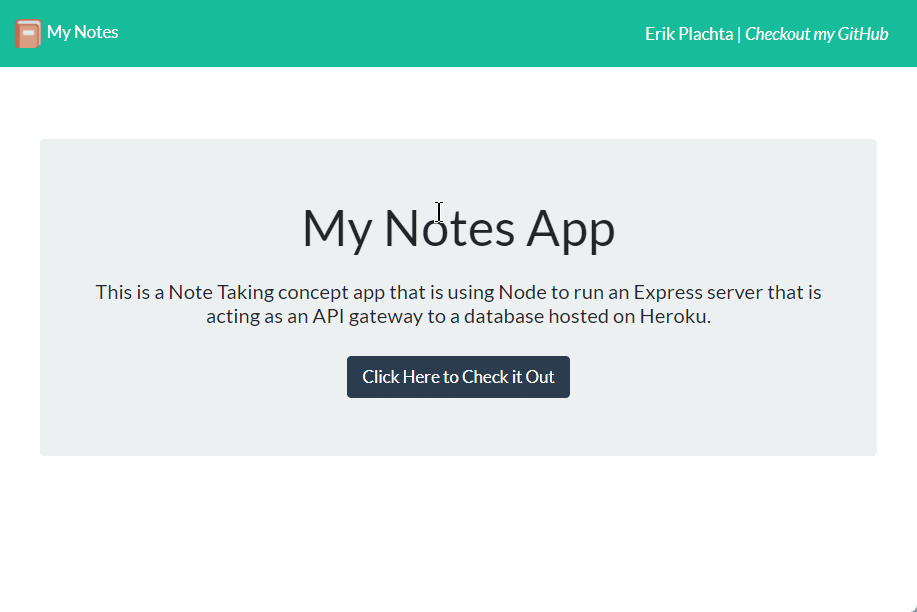

# My Notes App with Node, Express, and Heroku

## Description

Using Node to run an Express server hosted on Heroku
> This is a Note Taking concept web APP built on Node.js, demonstrate how Express.js
> can be used as an API gateway to a JSON database. Heroku is hosting the node server
> here: <a href="fast-peak-76189.herokuapp.com/">fast-peak-76189.herokuapp.com/</a>.

## Index

- [Requirements](#requirements)
- [Using The App](#using-the-app)
- [Video of Full Process](#video-demonstrating-useage)    
- [Repo Stats](#repo-stats)
- [Contributors](#contributors)
- [Questions?](#questions)
- [Future Goals](#future-goals)

## Using the App

> This APP is hosted here: <a href="fast-peak-76189.herokuapp.com/">fast-peak-76189.herokuapp.com/</a>,
> and be used by anyone simply by browsing this URL.

## Requirements

- Active internet connection.
- A web-brower.

## Video Demonstrating Useage

Here is a video demonstrating what the APP can do!
> *Typo at end of video, 'notes' is meant to be singular. ( 'note' not 'notes' )*
<!--  -->

## Repo Stats

## Contributors

### [Erik Plachta](https://github.com/ErikPlachta)

- Built Node.js that is running an Express.js to play as a gateway between the EU
and Heroku.
- Personalized source content

### [Xandromus - AKA - Xander Rapstine](https://github.com/Xandromus)

- Built the HTML, CSS, and JS framework of the project

---

## Questions?

Let's get in touch :point_down:

> Feel free to contact me on my Twitter @ErikPlachta

---

## Future Goals

- [ ] Add testing with [Jest - Issue #22](https://github.com/ErikPlachta/node-express-notes-app/issues/22)
- [ ] Add [Modular routing with Express - Issue #19](https://github.com/ErikPlachta/node-express-notes-app/issues/19)
- [ ] Add [System Database for Admin Logging - Issue #20](https://github.com/ErikPlachta/node-express-notes-app/issues/20)
- [ ] Add [Ability to edit existing notes - Issue #21](https://github.com/ErikPlachta/node-express-notes-app/issues/21)
- [ ] Add [Mobile-Friendly Design - Issue #29](https://github.com/ErikPlachta/node-express-notes-app/issues/29)
